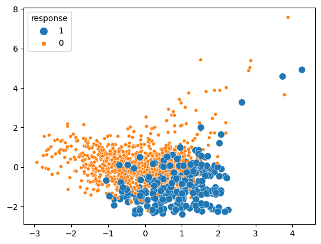

# Detecting Illegal Fishing in Real-time

Badges from [here](https://shields.io/)

### Authors

- [@geetakingle](https://www.github.com/geetakingle)

I have a passion for the oceans. They play a huge role in climate and support the lives of millions of people. Illegal, unreported, and unregulated (IUU) fishing is a major concern for long term sustainability for the fishing industry and ocean health. It undermines the efforts of fishers that employ legal and ethical means of fishing, threatens vulnerable populations of sea life, and contributes to declining ocean health

By using supervised and semi-supervised learning, I decided to develop an Anomaly Detection model that detects IUU activities using loitering events on any given trip for any given vessel, using real-time data obtained from Global Fishing Watch (GFW)

## Key Findings

### Binary Classification is possible between loitering signatures of vessels exhibiting IUU vs. non-IUU behaviours. A decision boundary can be exploited to develop a comprehensive Anomaly Detection Model that can detect IUU signatures in real-time

## Table of Contents

  - [Problem Statement](#problem-statement)
  - [Data source](#data-source)
  - [Methods](#methods)
  - [Tech Stack](#tech-stack)
  - [Quick Peek at Results](#quick-peek-at-results)
  - [Conclusions and Lessons Learned](#conclusions-and-lessons-learned)
  - [Limitations and Further Improvements](#limitations-and-further-improvements)
  - [License](#license)

## Problem Statement

Illegal, unreported, and unregulated (IUU) fishing result in ocean exploitation and frequently use slave labour (blatant violations of human rights). Furthermore, IUU fishing is detrimental to the long-term sustainability of the fishing industry. It undermines the efforts of fishers that employ legal and ethical means of fishing, threatens vulnerable populations of sea life, and contributes to declining ocean health.

This model classifies IUU events in real-time from a loitering event (as described by [Global Fishing Watch](https://globalfishingwatch.org/faqs/what-is-loitering-event/)). Real-time data can be obtained from Global Fishing Watch's [API](https://globalfishingwatch.org/our-apis/)

## Data Source

No explicit dataset was readily available. I used secondary datasets from current research conducted by Global Fishing Watch (GFW) to create the pertinent dataset required for this analysis: 

- Illegal human trafficking on Ships: Through eyewitness accounts, prosecution data, and machine learning, GFW has classified vessel characteristics and movement data for ships suspected to be engaged in human trafficking from. This dataset, found here, contains labelled responses per ship per year (illegal trafficking yes/no) with anonymized ship IDs from 2012 to 2018. Each datapoint is one ship’s cumulative operating characteristics every year, with the dataset containing 66,369 samples.
    - Dataset [here](https://github.com/emlab-ucsb/slavery-in-fisheries.git)

- Loitering events: By analyzing GPS and AIS data, GFW has identified loitering events (under a certain set of rules) for ships from 2012 to 2019. This dataset includes characteristics of the loitering event, also called trip signature in this report, for given ship IDs. Each datapoint is one loitering event, with the dataset containing 190,344 samples.
    - Dataset [here](https://globalfishingwatch.org/data-download/datasets/public-revealing-the-supply-chain-at-sea-2021)

## Methods

- Data assembly and cleanup
- Exploratory data analysis
- Principal Component Analysis
- Machine Learning usign Sci-kit Learn 
    - Supervised Learning Models (Log Regression, SVM, Random Forests)
    - Semi-supervised Learning (Psuedo-Label Propogation)
    - Anomaly Detection (One Class SVM)
- Visualizations

## Tech Stack
- GFW API
- Python
- Pandas
- Scikit-Learn
- Seaborn

## Quick Peek at Results

Raw Data of Loitering events (labelled and unlabelled data)

Correlation Matrix of Features

PCA Analysis showing a BINARY CLASSFIICATION decision boundary may be learned

Example of Precision-Recall Curves for Logistic Regression

Verifying newly trained model on test data after propogating the Psuedo-Labels using Semi-Supervised Learning. Shown below is visualization of the confusion matrix

Visualizing the classified IUU vs. non-IUU loitering events

Since the dataset is imbalanced, F2 Score is used (Recall is weighted twice as much as Precision in the F-score). Rationale for this choice: it is preferential to identify IUU events with high confidence; it is crucial to correctly identify IUU events than to incorrectly classify them. Furthermore, we care about detecting IUU events with high certainty than IUU events closer to the decision boundary. Therefore, False Positives (FP), where model incorrectly classifies IUU as non-IUU, need to be weighted more False Negatives (FN), where model incorrectly classifies non-IUU as IUU, when making decisions. 

Final Model Balaced Accuracy - 86%

## Conclusions and Lessons Learned

The analysis of the loitering event dataset was able to determine a decision boundary that classified the loitering event as IUU activity or non-IUU activity. By using a supervised model trained on labeled data, the larger unlabeled dataset was pseudo-labeled to develop a robust anomaly detection model. This model can correctly classify the loitering events with up to 86% accuracy, as well as provide a ranking method that can be utilized by the end users to efficiently plan their inspection activities. Furthermore, the analysis also determined that distance from shore is the biggest indicator of an IUU event. Here is the breakdown

| Feature                                         | Importance   |
|------------------------------------------------ |--------------|
| Average Distance from Shore (nautical miles)    | 72.6897%     |
| Loitering Start Hour                            | 12.0359%     |
| Loitering Total Hours                           | 10.8072%     |
| Average Speed (knots)                           | 4.4672%      |

We see from the Model Labels that False Negative scores (non-IUU events classified as IUU event) lie close to the decision boundary; thus, ranking anomalies by their score remains a valid tactic to prioritize inspection of vessels by the appropriate authorities, as well as minimizing incorrect allocation of inspection resources. Ranking in this manner will reduce the chance of inspecting a legal vessel; this was made possible by weighing Recall more during model training.

Conversely, False Positives (IUU events classified as non-IUU events) scoring cannot be ranked. However, this is not necessary as there are no action-items for an in-class event. These IUU events will be missed 

## Limitations and Further Improvements

GFW’s classification model outputs whether a ship is suspected to have engaged in human trafficking over the course of the study period. Thus, an assumption required in the proposal is that the presence of human trafficking indicates IUU fishing activities as well. This is a valid assumption; police/enforcement agency reports have confirmed that ships use slave labor obtained through human trafficking for IUU fishing activities.

A limitation of this analysis results from requiring labelled data of ships that are suspected to engage in IUU events. Since this predisposition biases the data towards focusing on suspect ships, the dataset has an unproportionally high number of positive classifications to negative classifications, as compared to the large number of loitering events. The train/test split size and performance metrics are selected to handle these imbalanced proportions.

For the next steps in this analysis, I would like to use more sophisticated models to try an model the decision boundary, such as Deep Learning. I will also contact Global Fishing Watch to determine if there is any unpublished data available internally that can be used to further strengthen this analysis, such as more labeled data or additional features that could be added. Going further, the model can be deployed for practical use; the results from any action taken because of the model’s output should be used to further train and strengthen the model.

Even on the nearly unmonitored ocean where human activities can largely go unnoticed, the use of such data analyses is crucial to identify and prosecute vessels engaged in illegal activities that harm the delicate ecosystem, violate human rights, and nullify the efforts of law-abiding fishing organizations. 

## License

MIT License

Copyright (c) [2022] [Geetak Ingle]

Permission is hereby granted, free of charge, to any person obtaining a copy
of this software and associated documentation files (the "Software"), to deal
in the Software without restriction, including without limitation the rights
to use, copy, modify, merge, publish, distribute, sublicense, and/or sell
copies of the Software, and to permit persons to whom the Software is
furnished to do so, subject to the following conditions:

The above copyright notice and this permission notice shall be included in all
copies or substantial portions of the Software.

THE SOFTWARE IS PROVIDED "AS IS", WITHOUT WARRANTY OF ANY KIND, EXPRESS OR
IMPLIED, INCLUDING BUT NOT LIMITED TO THE WARRANTIES OF MERCHANTABILITY,
FITNESS FOR A PARTICULAR PURPOSE AND NONINFRINGEMENT. IN NO EVENT SHALL THE
AUTHORS OR COPYRIGHT HOLDERS BE LIABLE FOR ANY CLAIM, DAMAGES OR OTHER
LIABILITY, WHETHER IN AN ACTION OF CONTRACT, TORT OR OTHERWISE, ARISING FROM,
OUT OF OR IN CONNECTION WITH THE SOFTWARE OR THE USE OR OTHER DEALINGS IN THE
SOFTWARE.

About the License here: [MIT license](https://choosealicense.com/licenses/mit/) 